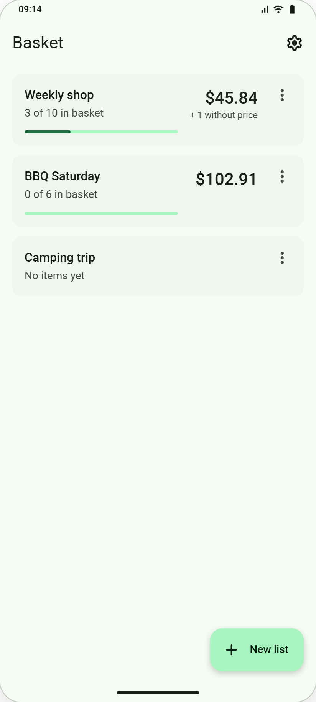
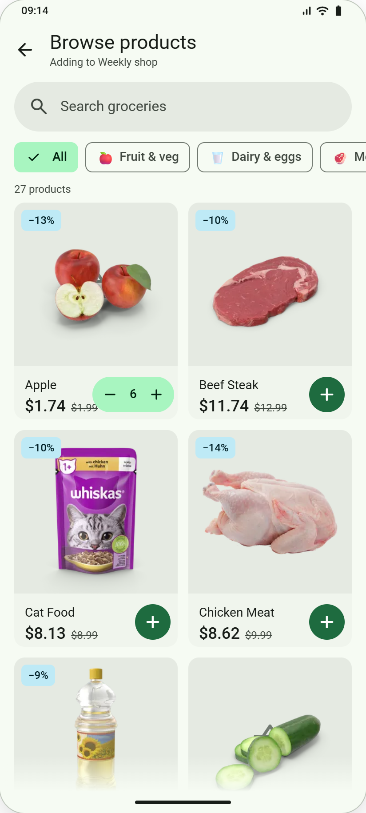
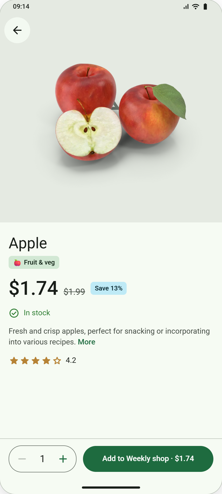

# Basket

Android shopping-list app: keep several grocery lists, add items by hand or from the DummyJSON groceries catalog, tick them off in the store and see what the trip will cost. Lists live on the phone (Room + DataStore); only the product catalog comes from the internet.

## Screens

Designs from the Basket design handover (light theme, English).

<table>
<tr><td align="center"></td><td align="center"></td><td align="center"></td><td align="center"></td></tr>
<tr><td align="center">Welcome</td><td align="center">Lists</td><td align="center">List detail</td><td align="center">Add / edit item</td></tr>
<tr><td align="center"></td><td align="center"></td><td align="center"></td><td align="center"></td></tr>
<tr><td align="center">Browse products</td><td align="center">Product detail</td><td align="center">Categories</td><td align="center">Settings</td></tr>
</table>

Welcome (first launch) · Lists · List detail (+ Finish shopping sheet) · Browse products (Compose) · Add / edit item · Product detail · Categories · Settings (Fragments + XML views), all hosted in one Compose `NavHost`.

## Stack

Kotlin 2.0 · Jetpack Compose (Material 3) and Material Components XML views · Navigation Compose with type-safe routes · Hilt · Room · DataStore · Retrofit + kotlinx.serialization + OkHttp · Coil · AppCompat per-app languages (English, Spanish, Arabic).

## Modules

| Module | What it contains |
|---|---|
| `:app` | UI (Compose screens and XML Fragments), data (Room, DataStore, catalog API, seed import), theme and navigation |
| `:core:domain` | Pure Kotlin product rules (`BasketRules.kt`) and model, with unit tests |

The app ships with sample data (`app/src/main/assets/sample-data.json`: Weekly shop, BBQ Saturday, Camping trip and the default aisles). The Welcome screen, shown once on first launch, offers *Get started* (imports the sample lists) or *Start without sample lists* (default aisles only). *Settings → Reset sample data* imports it again at any time.

The catalog comes from `https://dummyjson.com` (no key). `core/domain/src/test/resources/groceries.json` is a saved response used by the unit tests only.

## Building

Requirements: Android Studio Ladybug (2024.2) or newer, JDK 17+.

```bash
./gradlew assembleDebug          # debug build
./gradlew test                   # unit tests (domain rules)
./gradlew :app:lintDebug         # lint (same as CI)
./gradlew assembleRelease        # minified release build, signed with the debug key
```

## Debugging notes

- Debug builds log catalog requests to Logcat (tag `okhttp.OkHttpClient`).
- To test offline behaviour, turn on airplane mode on the emulator (`adb shell cmd connectivity airplane-mode enable`).
- To start from the sample data again: *Settings → Reset sample data*. To see the Welcome screen again: `adb shell pm clear com.basket`.
- To try the translations: *Settings → Language*, or `adb shell cmd locale set-app-locales com.basket --locales es`.
